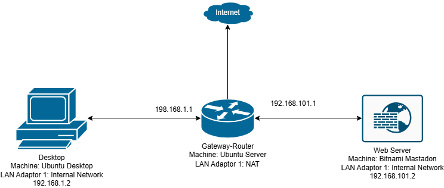

# Building a Virtual Sandboxed Network Using VirtualBox 
This repository contains a the detailed documentation of creating a private sandboxed network using VirtualBox. 

#### Table of Contents

- [Network Diagram](#NetworkDiagram)
- [IP Tables](#IPTables)

This network contains: 
Desktop VM: Used as the management interface for configuring other VMs. It is on subnet one and is powered by Ubuntu Desktop 
Gateway VM: Acts as the network gateway with three LAN cards. One LAN card with internet access and another two LAN cards denoting two separate subnets. It is powered by Ubuntu Server 
Application Server VM: It is on subnet two and powered by Bitnami Mastadon, a social networking server. 

# Network Diagram

# IP Tables
